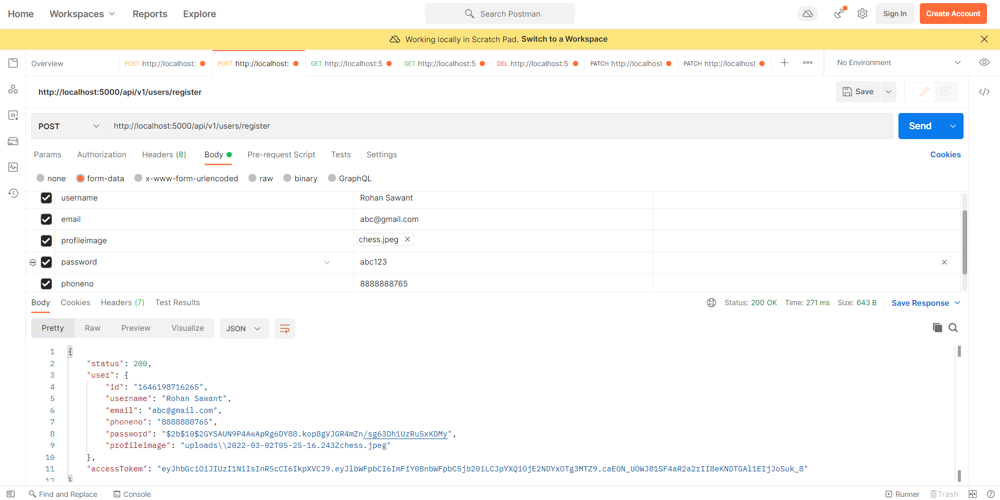
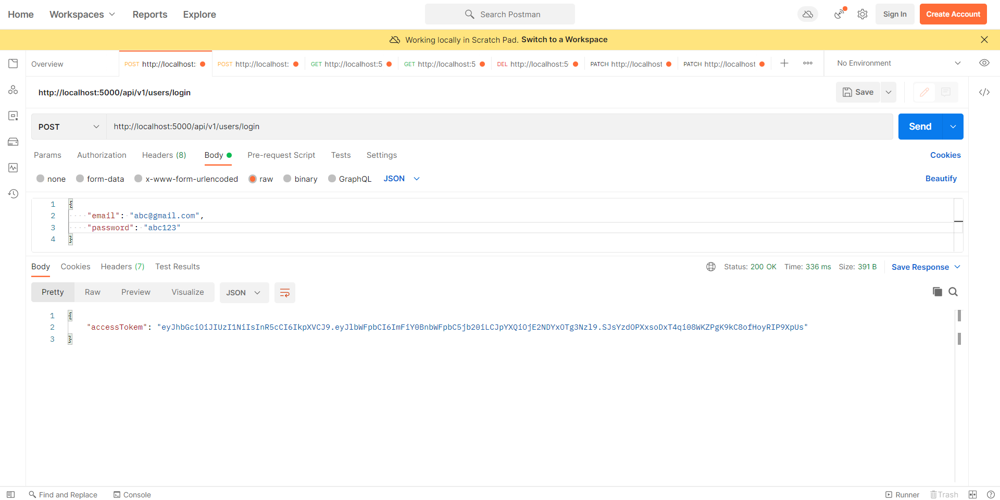
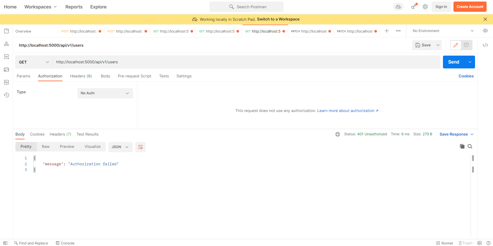
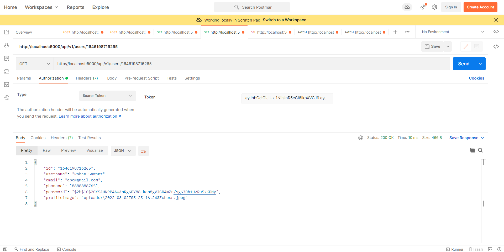
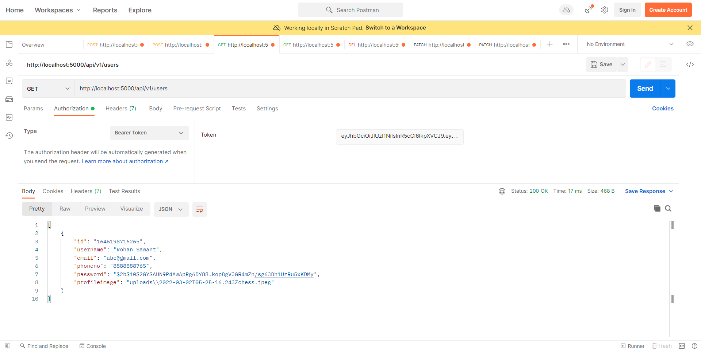
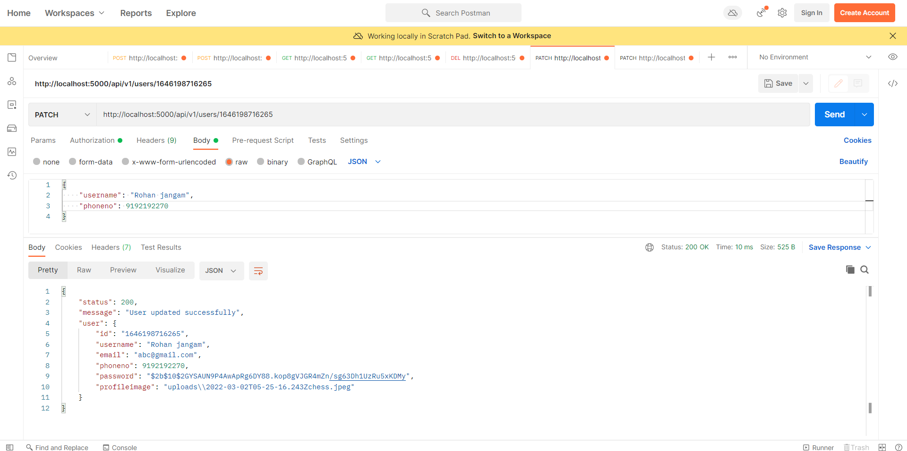
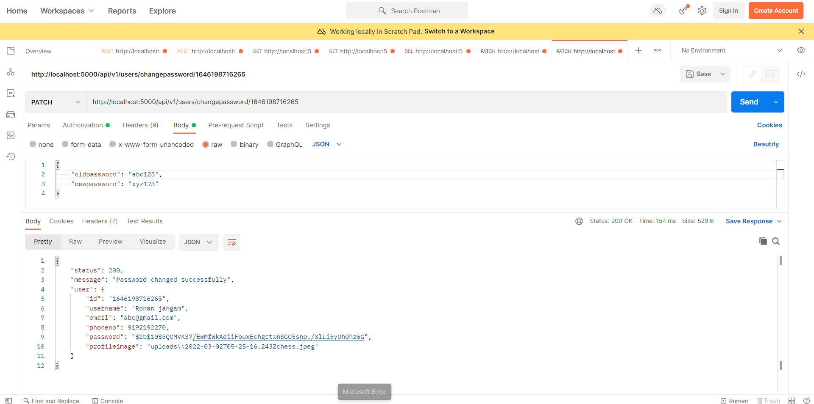
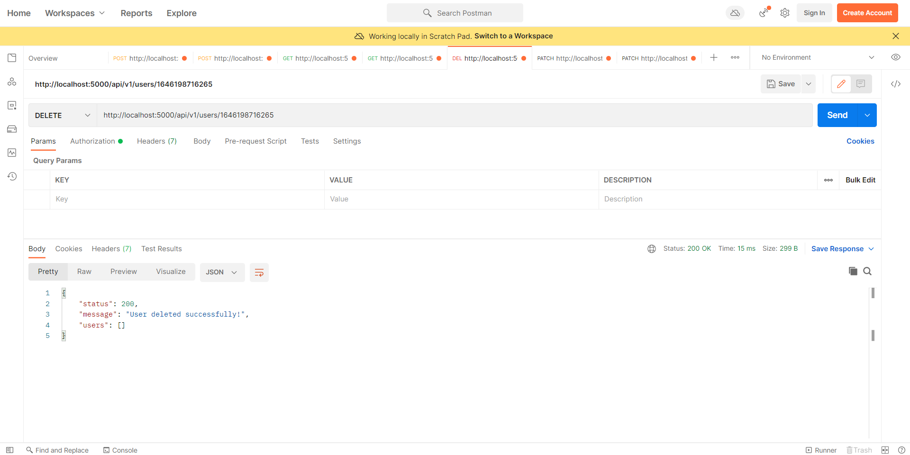

# node-assignment

## Setup

### 1. The first thing to do is to clone the repository:

```sh
$ git clone https://github.com/Siddhesh8220/node-assignment.git
$ cd node-assignment
```

### 2. Then install the dependencies:

```
$ cd CRUD_API_Node_js
$ npm install
```

### 3. Run Project

```
$ npm start
```

And navigate to `http://127.0.0.1:5000`.

### 1. Register User



### 2. Login User



### 3. Failed Authorization



### 4. Get specific user



### 5. Get all users



### 6. Update user data



### 7. Change Password



### 8. Delete User



